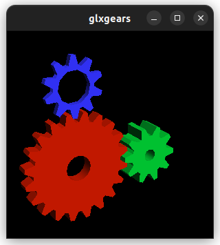
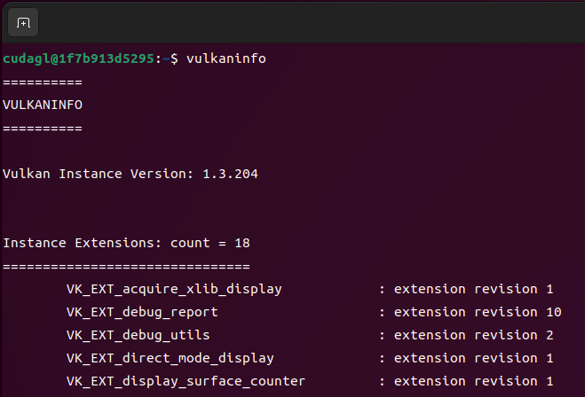

# atinfinity/cudagl

## Introduction

This is a Dockerfile to use OpenGL/CUDA/Vulkan with ROS2 humble on Docker container with NVIDIA GPU.

|glxgears|vulkaninfo|
|---|---|
|||

## Requirements

- NVIDIA graphics driver
- Docker
- xorg-xhost
- nvidia-container-toolkit

## Build docker image

### non-root user

```bash
docker build --build-arg UID=$(id -u) --build-arg GID=$(id -g) -t atinfinity/cudagl:11.8.0-cudnn8-devel-ubuntu22.04 .
```

### root user

```bash
docker build -t atinfinity/cudagl:11.8.0-cudnn8-devel-ubuntu22.04 -f Dockerfile.root .
```

## Launch docker container

```bash
./launch_container.sh
```
